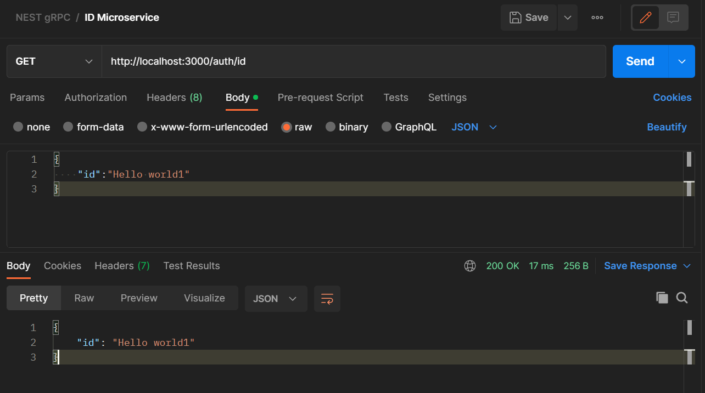

## NestJS gRPC based microservice

To get started with the project 

```sh
./setup.sh
docker-compose up
```
N.B - Docker-compose file provided is for dev environment and supports hot reloading.

1.Sample microsevice


2.Auth microservice


3.Communication from auth from client to ID (Intermicroservice communication)
